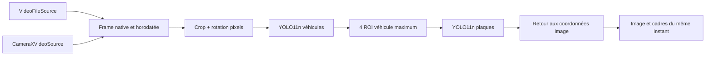

# Architecture SpeedVision — Sprint 2

## Modules et responsabilités

```text
app/                             Assemblage Android/Hilt
  camera/CameraXVideoSource       ImageAnalysis, permissions et lifecycle
  data/VideoFileSource            MediaExtractor + MediaCodec, vrais PTS
  vision/OnnxDetector             Prétraitement et session ONNX CPU
  vision/DetectionEngine          Véhicules → ROIs bornées → plaques
  presentation/PreviewViewModel   Coroutines, état, annulation, statistiques
  MainActivity.kt                 Compose, source, cadres et diagnostics
 domain/                         Kotlin/JVM sans Android
  VideoSource / VideoFrame        Contrat, pixels, PTS, origine, crop natif
  Detection / Letterbox           Coordonnées et inverse resize/padding
  YoloPostprocessor               Validation sortie, filtre classes, NMS
  LatencyWindow                  Statistiques bornées p50/p95
 models/                         Audit des poids et procédure de préparation
 scripts/                        Provisionnement vérifié, évaluation, checks
 testing/                        Protocoles et tests Python de métriques
```

Hilt injecte les factories et un moteur propre au ViewModel. Le domaine ne dépend ni d'Android ni du runtime ML. Détection et tracking sont distincts : aucune identité temporelle n'est attribuée au Sprint 2; `vehicleIndex` est uniquement l'indice du parent dans une image.



## Géométrie et pixels

Le fichier conserve les pixels du crop natif, jusqu'à la limite d'entrée 1920 × 1920. CameraX demande 1280 × 720, mais la résolution effective dépend du matériel et est enregistrée. `FrameGeometry` conserve dimensions natives, origine du crop et origine temporelle. La rotation 0/90/180/270 est appliquée avant l'inférence. Les boîtes sont exprimées en pixels de cette image redressée.

Chaque réseau reçoit une entrée RGB float32 NCHW 640 × 640, après resize conservant le ratio et padding 114. `Letterbox` conserve les dimensions redimensionnées entières et inverse exactement scale/padding; l'étage plaque ajoute l'origine ROI. Les limites sont clampées, NaN/Inf et géométries dégénérées rejetées. L'overlay utilise le même ajustement `Fit` que l'image : marges et échelle sont identiques.

Le futur moteur géométrique devra transformer K pour le crop/rotation exact et travailler sur la géométrie observée. Il ne peut pas réutiliser sans transformation une calibration native sur l'entrée 640 du réseau. Les cadres du détecteur ne sont pas des coins de plaque.

## Temps, ressources et cycle de vie

Vidéo : sélection par PTS à 10 images/s maximum. Le compteur garde la séquence décodée avant échantillonnage. Caméra : timestamps `imageInfo.timestamp` en microsecondes, distincts d'une horloge média; `KEEP_ONLY_LATEST` et fermeture de tous les `ImageProxy`. Les sources n'enregistrent rien.

`Flow.conflate()` conserve la dernière frame disponible pendant l'inférence. Pas de file illimitée; les écarts de séquence visibles sont comptés, sans prétendre compter les images perdues en amont du callback caméra. L'affichage attend le résultat correspondant à l'image traitée; un ancien résultat n'est pas superposé à une nouvelle image.

Un compteur de session invalide le travail en cours sur STOP/START/remplacement. Les erreurs et les boîtes sont effacées aux transitions appropriées. Les appels ONNX natifs ne sont pas interrompus au milieu d'un opérateur : leur résultat est abandonné si la coroutine/session est annulée. Un Mutex sérialise exécution et fermeture des sessions; les tenseurs/résultats natifs sont fermés à chaque passage. Le ViewModel ferme les sessions à sa destruction.

CameraX est lié au lifecycle de l'activité, utilise un executor unique et ne demande que CAMERA. Le passage en arrière-plan stoppe. La destruction détache la caméra, libère observer/executor et impose une nouvelle sélection, évitant de conserver une ancienne activité après rotation. Le lecteur de fichier peut conserver son ViewModel, sans redémarrage automatique.

## Performance et qualité

Détection CPU/2 threads, seuil 0,35, NMS 0,45 et 30 véhicules maximum. Au plus quatre ROI sont traitées par ordre de score; les omissions sont affichées. Conséquence assumée : une plaque sans véhicule détecté est manquée. Les durées incluent pré/post-traitement; le chargement initial des sessions est exclu de p50/p95. Fenêtre de 120 mesures, compteur visible. Le temps depuis décodage inclut attente et traitement, mais ne prétend pas mesurer exposition caméra → affichage.

Les assets absents ou incompatibles donnent un état explicite; jamais une détection factice. Le script vérifie les poids amont, l'application vérifie les hashes des exports avec leur manifeste. Aucune confiance de vitesse n'est calculée.

## Suite planifiée

Sprint 3 : tracker séparé, association et invalidation d'identité. Sprint 4 : calibration, profils physiques et PnP/DistanceEstimator. Sprint 5 : SpeedEstimator robuste et qualité. Sprint 6 : CameraMotionCompensator avec limites d'observabilité. Sprint 7 : politique d'annonces et AudioOutput/TTS. Sprint 8 : adaptateur Meta officiel revalidé. Sprint 9 : optimisation et validation indépendante sur matériel.

Voir [algorithme mathématique](docs/ALGORITHM.md) et [audit modèles](models/README.md). Le runtime ONNX a été choisi ici pour charger les poids réels disponibles sans ajouter une seconde conversion TFLite; ce choix devra être benchmarké face aux alternatives sur téléphone cible.
