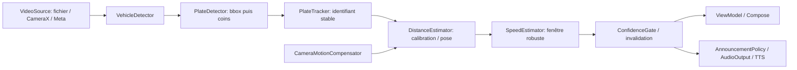

# Architecture SpeedVision

## Incrément actuel

Deux modules Gradle suffisent pour isoler le domaine sans créer douze modules vides :

```text
app/                         Android et assemblage Hilt
  src/main/java/fr/speedvision/
    data/                    VideoFileSource, conversion YUV pour aperçu
    di/                      factory de source avec contexte application
    presentation/            PreviewViewModel, état immuable
    MainActivity.kt          Compose et cycle de vie
  src/test/                  conversion pixels
  src/androidTest/           vrai décodage, erreurs, interface
  src/androidTest/assets/     vidéo synthétique de test sans plaque
 domain/                     Kotlin/JVM indépendant d'Android
  src/main/kotlin/.../        VideoSource, VideoFrame, FrameSampler, AudioOutput
  src/test/kotlin/.../        sélection temporelle
 docs/                       faisabilité et mathématiques
 testing/                    protocole/dataset
 scripts/                    vérification reproductible
 .github/workflows/           build, lint, formatage, tests, émulateur
```

Flux présent : sélection explicite URI → factory Hilt → MediaExtractor/MediaCodec sur IO → YUV_420_888 vers ARGB → Flow → ViewModel → Compose. Les images ont les PTS du décodeur, en microsecondes. L'aperçu est plafonné à 10 fps / 640 px, sans prétendre mesurer le débit du flux natif. La rotation est appliquée à l'affichage. Les couleurs de l'aperçu utilisent BT.601 limité; colorimétrie exacte et HDR exclus.

Le Flow ne conserve pas les images et applique une contre-pression au consommateur. Un Mutex évite deux décodeurs simultanés d'une même source lors d'un STOP/START rapide. L'annulation ferme les ressources dans `finally`. Le changement de source annule les abonnements précédents. STOP garde la dernière image; START relit depuis le début. Le passage en arrière-plan arrête; aucun service en arrière-plan. Une recréation conserve le ViewModel mais ne relance pas automatiquement. Après mort du processus, sélection à refaire.

## Architecture cible (Sprints 2–9, non implémentée)



Créer progressivement `vision/detection`, `vision/tracking`, `geometry`, `speed`, `camera`, `meta`, `speech`, `data/calibration`, `testing` lorsque leur sprint ajoute un comportement réel. Le domaine définit les contrats et résultats, les adaptateurs Android dépendent de lui. Les modèles/runtimes dépendent d'interfaces de détection, pas de l'UI. Hilt compose les implémentations. Pas de `MetaGlassesVideoSource` factice qui prétend fonctionner.

Avant le Sprint 2, enrichir `VideoFrame` avec résolution native, crop, transformation vers coordonnées analysées, origine temporelle et compteur de frames ignorées. Garder les pixels haute résolution nécessaires aux plaques; le buffer actuel est exclusivement un aperçu. Les intrinsics se transforment avec le resize/crop/rotation exact. Ne pas appliquer directement une calibration native à l'aperçu.

## Contrats futurs

- `CameraCalibration(fx, fy, cx, cy, distortionCoefficients, imageWidth, imageHeight, sourceId, mode, version)`.
- `DistanceEstimator` reçoit géométrie plaque, dimensions réelles configurées, calibration et pose; retourne profondeur, incertitude, score, raisons, PTS.
- `SpeedEstimator` reçoit `(trackId, distance, sigma, PTS)` et retourne vitesse signée, intervalle si validé, nombre de points, score et raisons de rejet.
- `CameraMotionCompensator` retourne rotation estimée, qualité, résidu de flot et limites d'observabilité; jamais une translation métrique inventée.
- `SpeedResult(vehicleId, speedKmh, confidence, distanceMeters, timestamp)` complété par statut valide/rejeté et âge.
- `AudioOutput` est séparé de la politique d'annonce : confiance/stabilité, délai minimal, delta de vitesse et expiration. Dire « vitesse relative de rapprochement ».

Les erreurs source, absence de modèle, calibration invalide et tracking perdu sont des états normaux, pas des valeurs nulles remplacées par zéro. Changement de véhicule, perte prolongée ou discontinuité temporelle invalident toute la fenêtre vitesse et toute annonce en attente.

## Décisions

1. Min SDK 28, compile/target 35, Java 17, Kotlin 2.1.10, AGP 8.9.1 : base versionnée pour cet incrément; revalider les exigences de publication et du SDK Meta ultérieurement.
2. MediaCodec au lieu d'une extraction par temps demandé : les PTS sont ceux des frames réellement décodées ([référence Android](https://developer.android.com/reference/android/media/MediaCodec)).
3. Lecture vidéo muette : TTS relève du Sprint 7; aucune permission audio inutile.
4. Préférer mesurer les limites, puis optimiser. Aucun réseau, modèle ou SDK Meta embarqué à ce stade.
