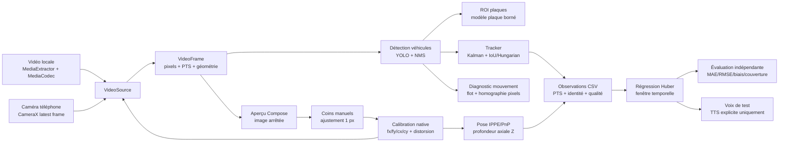

# SpeedVision

Prototype Android expérimental d'estimation de **vitesse relative axiale** à partir d'une plaque connue ou, en secours, de la largeur moyenne d'un véhicule. Le laboratoire calcule une vitesse relative sur séries de profondeur horodatées. L'aperçu peut maintenant afficher une estimation live lorsque calibration, piste, caméra fixe et fenêtre temporelle sont valides. Le résultat reste expérimental et n'est pas une vitesse routière certifiée.

## Utiliser

Android 9/API 28 minimum. Choisir une vidéo locale MP4/H.264 SDR (≤ 1920 × 1920) ou la caméra arrière du téléphone, puis START. L'autorisation caméra n'est demandée qu'au choix de cette source. STOP arrête; START rejoue le fichier ou relance la caméra. Le passage en arrière-plan arrête le flux. Après recréation de l'écran, choisir à nouveau la caméra.

Avec les modèles provisionnés, les cadres verts indiquent les véhicules et les jaunes les plaques candidates. Le bouton Détection permet de comparer avec la lecture seule. Le diagnostic affiche le débit effectivement traité, les zones omises, les latences CPU p50/p95 et le temps depuis décodage. Les identifiants de piste apparaissent sur les cadres : provisoire après détection, confirmée après trois observations consécutives, perdue en gris pendant au plus 500 ms sans observation. Une prédiction perdue ne constitue pas une mesure de plaque. STOP, changement de source ou de géométrie et activation/désactivation de la détection réinitialisent le suivi.

Le diagnostic du fond indique les correspondances, leur couverture et le résidu d’alignement. Une homographie acceptée reste un alignement en pixels : rotation et translation métrique ne sont pas séparées. Sans masque de détection, ce calcul est indisponible. [Contrôles et limites du sprint 6](docs/SPRINT_6_REPORT.md).

Sans modèles, le lecteur et CameraX fonctionnent et la détection indique son indisponibilité. Aucun téléchargement n'est effectué par l'application. [Préparer les modèles et comprendre leurs limites/licences](models/README.md).

Après lecture, ouvrir **Calibration / distance sur image arrêtée** pour importer/saisir une calibration, définir les dimensions physiques et sélectionner les quatre coins réels. La mesure est expérimentale, sans incertitude métrique quantifiée. [Procédure et limites](CALIBRATION.md).

Pour ajuster le fallback véhicule avec une vidéo dont la vitesse est connue, suivre le parcours [Calibration par vidéo](docs/VIDEO_CALIBRATION.md). Le profil est conservé par géométrie exacte de source et peut être exporté en JSON.

Ouvrir **Laboratoire de vitesse / CSV** pour analyser une série à caméra fixe, consulter les rejets et exporter les résultats. Un exemple synthétique peut être chargé explicitement. [Schéma CSV, protocole et limites](testing/speed/README.md).

## Fonctionnement de bout en bout

Le chemin de traitement est séparé en sources, perception, géométrie et analyse temporelle. Chaque image conserve sa largeur, sa hauteur, son orientation, son numéro de séquence et son PTS en microsecondes. Le temps d’arrivée et le temps de calcul servent uniquement au diagnostic de performance ; ils ne remplacent jamais le PTS de la vidéo.



Le détecteur véhicule limite les classes à voiture, moto, bus et camion. Les plaques sont recherchées dans au plus quatre ROI de véhicules ; une ROI omise est comptée comme omise et non comme une absence de plaque. Le tracker reste indépendant du détecteur : trois observations consécutives confirment une piste, une perte est conservée au plus 500 ms, puis l’identité est expirée.

La calibration est appliquée au repère natif de la source. Les quatre coins sont saisis dans l’ordre haut gauche, haut droit, bas droit, bas gauche. Après sélection, les flèches déplacent un coin d’un pixel natif ; l’affichage arrondit uniquement pour présenter des coordonnées entières, tandis que les calculs géométriques conservent la précision interne. La pose est rejetée si les contrôles de profondeur, reprojection, inclinaison ou ambiguïté échouent.

La profondeur obtenue sur une image arrêtée est exportable comme observation déclarée. Le laboratoire ne prend pas de largeur de boîte comme distance : il exige une profondeur axiale, une identité, une calibration, un PTS, une qualité et une caméra fixe déclarée. La vitesse relative signée est la dérivée robuste de Z ; positive signifie rapprochement. Elle est calculée sur un CSV historique, au centre de la fenêtre, et n’est pas une vitesse routière absolue ni une mesure live.

Le Sprint 10 prépare une profondeur de secours par largeur moyenne de véhicule lorsque la plaque est trop petite. Cette voie reste un a priori de classe, avec une qualité dégradée et des rejets conservateurs ; elle ne remplace pas la pose par plaque et ne peut devenir une vitesse live qu’après validation de la calibration, de la piste, de la caméra et d’un corpus indépendant. Voir le [plan du Sprint 10](docs/SPRINT_10_PLAN.md).

## Méthode et choix techniques

- **Architecture** : application Kotlin Compose/MVVM/Hilt, domaine Kotlin sans dépendance Android, sources vidéo interchangeables et états explicites `READY`, `PLAYING`, `STOPPED`, `ENDED`, `ERROR`.
- **Temps et mémoire** : PTS strictement croissants, échantillonnage d’aperçu borné à 10 images/s, buffers SDK copiés avant suspension, annulation structurée et arrêt en arrière-plan. Le prétraitement ONNX réutilise ses tableaux et son bitmap par session ; cette optimisation ne constitue pas une promesse de latence.
- **Perception** : modèles ONNX versionnés et hashés localement, poids exclus de Git, classes et formats vérifiés à l’ouverture, NMS par classe et budget ROI explicite.
- **Géométrie** : calibration intrinsèque native, distorsion Brown, pose IPPE/PnP, profondeur Z positive et contrôles de reprojection. Les coins d’une boîte détectée ne sont jamais utilisés comme coins physiques.
- **Vitesse** : régression Huber pondérée sur timestamps réels, rejets sur piste/calibration/source/gaps invalides, comparaison avec OLS, Kalman, quadratique et consensus dans le benchmark synthétique.
- **Validation** : tests JVM déterministes, tests Python de schémas et métriques, tests instrumentés Android et CI avec profils sans SDK et Meta. Les mesures terrain doivent provenir d’une référence indépendante tenue à part.

## Actions menées par sprint

- **Sprints 0–1** : faisabilité Meta sourcée, architecture, contrats du domaine, backlog et CI ; lecteur MediaExtractor/MediaCodec, PTS, sélection de fichier, START/STOP, EOF, erreurs et cycle de vie.
- **Sprint 2** : détection YOLO véhicules, modèle plaque en ROI, CameraX, audit des poids et tests de formats, rotations et latences.
- **Sprint 3** : tracker Kalman/SORT avec association Hungarian/IoU, confirmation, expiration et réinitialisations par source ou géométrie.
- **Sprint 4** : assistant de calibration, import/export JSON, coins manuels, ajustement pixel par pixel, pose et profondeur axiale sur image arrêtée.
- **Sprint 5** : observations CSV strictes, régression Huber, rejets temporels et laboratoire de vitesse hors ligne.
- **Sprint 6** : flot du fond OpenCV, masque des véhicules, homographie en pixels et diagnostics de couverture/résidu, sans compensation métrique inventée.
- **Sprint 7** : politique anti-spam et adaptateur TTS français hors ligne, écran de test explicite, arrêt sur perte de focus ou de route audio.
- **Sprint 8** : intégration DAT 1.0 opt-in, permissions et inscription Meta, flux YUV/PTS strict, arrêt sur déconnexion, manifeste et audit de confidentialité.
- **Sprint 9** : évaluateur de référence, couverture/rejets, comparaison de rapports, benchmark Android p50/p95/débit/thermique et réutilisation des buffers ; essais CPU sur Z Flip7 documentés sans gain artificiel.

Les détails, commandes et limites de chaque étape sont dans [BACKLOG.md](BACKLOG.md), [SPRINTS.md](SPRINTS.md) et les [rapports de sprint](docs/).

Le Sprint 7 est commencé : **Voix / test audio** permet de vérifier le moteur TextToSpeech avec une phrase sans mesure, après activation explicite. Une voix française hors ligne doit être installée dans Android. Les annonces automatiques et les essais Bluetooth matériels restent ouverts. [État et limites](docs/SPRINT_7_REPORT.md).

Le Sprint 8 ajoute un **build Meta explicite** pour connecter les lunettes avec le SDK officiel DAT 1.0.0. Le build habituel conserve son fonctionnement sans SDK. [Configuration du Z Flip7 / Wayfarer, compilation et essais](META.md). La réception sur vos lunettes reste à valider sur matériel.

## Compiler et tester

JDK 17, SDK 35/build-tools 35.0.0, wrapper Gradle 8.11.1. Définir sdk.dir dans local.properties (non versionné) ou ANDROID_HOME. Installer les dépendances Python de calibration dans `.tools/calibration-env` comme décrit dans [CALIBRATION.md](CALIBRATION.md), ou dans le Python utilisé par le script :

```sh
./scripts/check.sh
```

Le script exécute les tests Python de métriques, les tests JVM, le formatage, lint et l'assemblage des APK application/tests. Sur ce poste, le JDK et le SDK sont isolés dans `.tools/` et sélectionnés par le script. Pour Gradle directement :

```sh
export JAVA_HOME="$PWD/.tools/jdk/Contents/Home"
export ANDROID_USER_HOME="$PWD/.tools/android-user"
export GRADLE_USER_HOME="$PWD/.tools/gradle-home"
./gradlew :app:connectedDebugAndroidTest
# Après provisionnement : imposer l'exécution des vrais modèles
./gradlew :app:connectedDebugAndroidTest -Pandroid.testInstrumentationRunnerArguments.requireModels=true
```

APK local : `app/build/outputs/apk/debug/app-debug.apk`. Les modèles AGPL ne sont pas suivis dans Git; ils sont inclus dans l'APK local seulement après provisionnement explicite. Le choix de licence de distribution de SpeedVision reste à arrêter avant publication d'un APK avec poids. La CI générique compile sans modèles et signale les tests de réseaux ignorés. Le workflow manuel peut exécuter les modèles sur le runner sans publier d'APK contenant les poids.

## Conception et preuves

- [Architecture](ARCHITECTURE.md), [faisabilité Meta](docs/FEASIBILITY.md), [algorithme futur](docs/ALGORITHM.md)
- [Backlog](BACKLOG.md), [sprints](SPRINTS.md), [tests](TESTING.md), [calibration](CALIBRATION.md)
- [Audit et versions des modèles](models/README.md), [évaluation détection](testing/detection/README.md), [protocole vitesse terrain](testing/README.md)
- [Rapport Sprints 0–1](docs/SPRINT_REPORT.md) et [rapport Sprint 2](docs/SPRINT_2_REPORT.md), [rapport Sprint 3](docs/SPRINT_3_REPORT.md), [rapport Sprint 4](docs/SPRINT_4_REPORT.md), [rapport Sprint 5](docs/SPRINT_5_REPORT.md), [rapport Sprint 6](docs/SPRINT_6_REPORT.md), [début du Sprint 7](docs/SPRINT_7_REPORT.md), [rapport Sprint 8](docs/SPRINT_8_REPORT.md), [rapport Sprint 9](docs/SPRINT_9_REPORT.md)

La profondeur Z = fx W/w exige une pose et une calibration appropriées. Sa dérivée n'est pas une vitesse absolue routière. Un score de détecteur n'est ni une confiance de vitesse ni une précision acquise. Le modèle de plaques doit être évalué sur un corpus indépendant; aucune précision terrain n'est revendiquée.

## Données et Git

Traitement des images local, aucun OCR, aucune sauvegarde de vidéo ou de plaque. Le build habituel n’a aucune permission Internet, microphone ou stockage global. Le build Meta opt-in ajoute réseau/Bluetooth, avec les collectes optionnelles SDK désactivées; [détails et limites](META.md). Le sélecteur système donne accès au seul fichier choisi; préférer un fichier déjà local pour un essai hors ligne. Le SDK Meta est absent du build habituel et présent uniquement avec `-PmetaEnabled=true`. Les images publiques de smoke test sont téléchargées uniquement par le script de développement et ne sont pas des captures utilisateur.

Dépôt : [Valmdatascientest/speedvision](https://github.com/Valmdatascientest/speedvision). main stable, develop intégration, feature/*, fix/*, test/*. La première tranche de vitesse live du Sprint 10 est intégrée sur le téléphone ; la compensation métrique caméra, les annonces live et la validation Meta sur matériel restent à compléter.

Sprint 9 livré côté logiciel : [évaluation des vitesses](testing/speed/EVALUATION.md), [benchmark Android](testing/performance/README.md) et [rapport](docs/SPRINT_9_REPORT.md).

Sprint 9 : [benchmark Android explicite et protocole Z Flip7](testing/performance/README.md).
